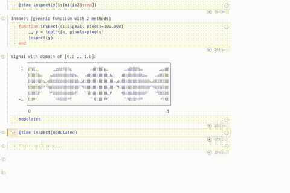

# Update 29.11.21
Heya,
I did some more cleanup. A smaller file which now works ok is `demo_cleaned.pluto.jl`. In that notebook I also included some timing info. The speedup with a sysimage (which must be loaded at Plutos startup with `Pluto.run(sysimage="<path/to/sysimage.so>")`) is ok but sadly the investigate of the slowdowns, which I tried to pinpoint in `demo_cleaned.pluto.jl` are inconclusive...

#### Further usage remarks:
WGLMakie is quite sensitive when it comes to mouse interactions. Panning and zooming is way more comfortable with an external mouse, this even gives kind of the desired "Google maps" feel Keno was hoping for. Moving the sliders with the arrow keys is also quite comfortable and feels a bit snappier. When Moving the Sliders a large distance it is more performant to just click on the desired location instead of dragging it along the entire way (due to rerendering). When zooming in one Figure and switching to another Figure an extra click is necessary to "activate" the newly designated Figure (I had to use two seperate Figures due to the WGLMakie/JSServe integration architecture). Once the Widget is loaded wiggling both sliders a little bit "wakes" WGLMakie up even further (don't know why this is happening but it is...) and after a short laggy update phase the widget is fully functional without further load times.

---

Hey Guys,
so I tried to build this scrubber widget thingy. I realised that `WGLMakie.jl`/`JSServe.jl` is magnitudes faster than simple `Plots.jl` updated in a loop and on top of that it's quit tricky to make a *single cell* widget with `Plots.jl` because of Plutos `@bind` not being allowed in the same cell; so I went ahead and took some time to get up to speed with WGLMakie and JSServe and have kind of a running demo. The thing that initialy held me back from using WGLMakie was the tremendous plotting times (its not unusual that the first plot takes 5+ mins! on my machine) which as I've now figured out is due to some Page/Session setup which even occasionaly Fails so one would need to call some `init()` function (currently not implemented) like `gr()` or `WGLMakie.activate()` which simply calls `JSServe.Page()` once to get going with the widget in Pluto. After the init the Plotting speed is quite ok I fell and I wan't to expose some more options and add some heuristics to produce nicer Plots. Some errors when scrolling past the signal get quietly ignored at the moment which I also intent to catch at some point. Tomorrow morning I'll setup a sysimage and see if that improves the initial load time. Once the Page is initialized displaying the Widget usually only takes XXXs. The  widget function which I've currently dubbed `inspect` works primarily with arrays of data so I dispatch on Signals by calling `AnalogCircuitSignal.toplots` to convert and discard the x axes (because I currently have the Sliders on a percentage base, i.e., show from 5% onwards, 17% of the signal; thought this could be more intuitive then the actual sample indices; let me know what you think, I would be happy to make this optional or omit it alltogheter). The CSS also doesn't always wan't to load, haven't figured out why that is, the only thing it would do would be to align the sliders a little bit more with the Plots. I joinked Pepjins scope data, hope thats ok. Please feel free to ignore all my sanity checks (wen't kinda crazy with JSServe) :D will do some cleanup tomorrow.
Cheers!
